## Tensorflow Image Classification Demo on Kubernetes

This repo serves as an example to demonstrate the typical machine learning workflow and how to leverage existing machine learning toolkits for Kubernetes to enhance the development and operations lifecycle.

Here is what you will find in this repo:
* Train - how to take an Inception v3 model trained on ImageNet images to retrain a new top layer that can recognize new classes of images.
* [Automate](#retrain-model-locally) - how to run repeatable machine learning experiments using containers.
* Visualize - how to visualize machine learning trainings with Tensorboard.
* [Operate](#provision-immutable-infrastructure-with-kubernetes) - how to automate and provision production-ready immutable infrastructure with Kubernetes.
* [Deploy](#deploy-machine-learning-components-to-kubernetes-with-kubeflow) - how to deploy machine learning components to Kubernetes with Kubeflow.
* [Scale](#hyperparameter-sweep---scale-and-test-experiments-in-parallel-using-kubernetes-helm-virtual-kubelet-and-aci) - how to scale and test machine learning experiments in parallel using Kubernetes and helm.
* [Manage](#creating-end-to-end-pipelines-with-argo) - how to manage training jobs by creating end to end training pipelines with Argo.
* [Serve](#serve-a-trained-model-for-inference-with-kubeflow-tf-serving) - how to serve a trained model for inference with TF Serving as part of Kubeflow.
* [Rapid Prototype](#rapid-prototyping-with-self-service-jupyter-notebook-from-jupyterhub-with-github-oauth) - how to enable rapid prototyping with self-service Jupyter Notebook from JupyterHub with GitHub OAuth.

This example is based on the Tensorflow [Image Retraining example](https://github.com/tensorflow/hub/tree/master/examples/image_retraining). 

We have modified the example to retrain inception v3 model to identify a particular celebrity. Using the retrained model, we can get predictions like the following:

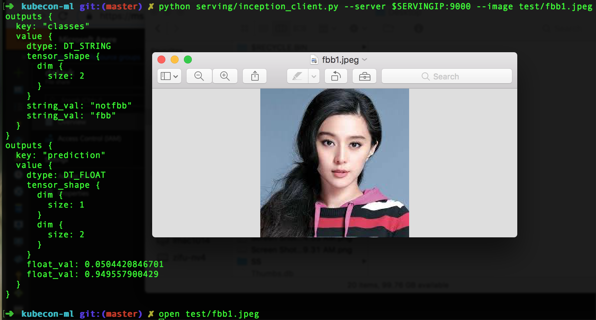

### Retrain Model Locally

* Train with Inception v3 and Automate with containers
    ```bash

    # build
    docker build -t ritazh/image-retrain-kubecon:1.9-gpu -f train/Dockerfile.gpu ./train

    # push
    docker push ritazh/image-retrain-kubecon:1.9-gpu

    # run
    docker run --rm -v $PWD/tf-output:/tf-output ritazh/image-retrain-kubecon:1.9-gpu "--how_many_training_steps=4000" "--learning_rate=0.01" "--bottleneck_dir=/tf-output/bottlenecks" "--model_dir=/tf-output/inception" "--summaries_dir=/tf-output/training_summaries/baseline" "--output_graph=/tf-output/retrained_graph.pb" "--output_labels=/tf-output/retrained_labels.txt" "--image_dir=images" "--saved_model_dir=/tf-output/saved_models/1"
    ```
    [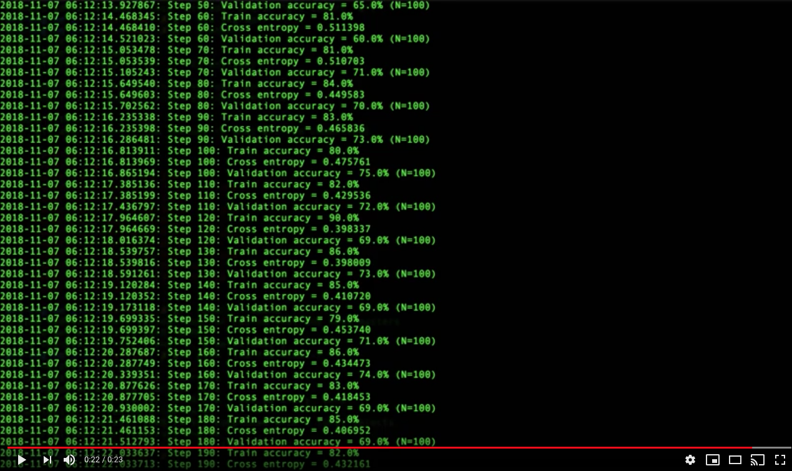](https://www.youtube.com/watch?v=7Ndx3HKaS5s)

* Visualize with Tensorboard
    ```bash

    # build
    docker build -t ritazh/tensorboard:1.9 -f ./train/Dockerfile.tensorboard ./train

    # push
    docker push ritazh/tensorboard:1.9 

    # run
    docker run -d --name tensorboard -p 80:6006 --rm -v $PWD/tf-output:/tf-output ritazh/tensorboard:1.9 "--logdir" "/tf-output/training_summaries"
    ```
    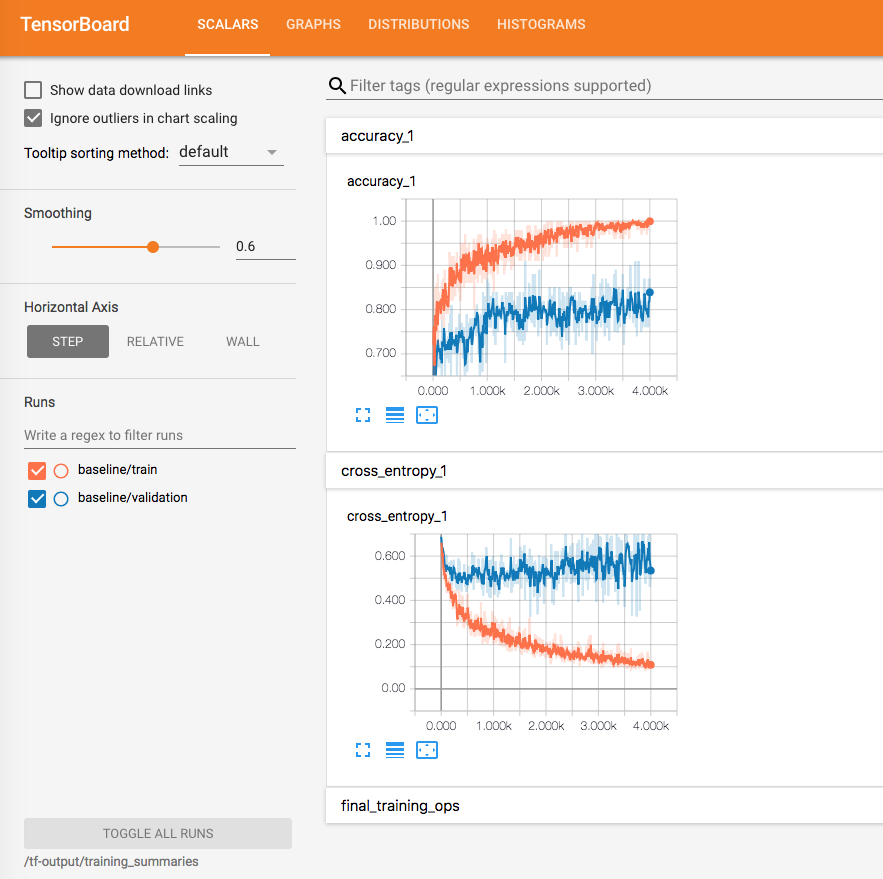

* Serve Trained Model for Inference with TF Serving
    ```bash

    docker run -d --rm --name serving_base tensorflow/serving
    docker cp tf-output/saved_models serving_base:/models/inception
    docker commit --change "ENV MODEL_NAME inception" serving_base $USER/inception_serving
    docker kill serving_base
    docker run -p 8500:8500 -t $USER/inception_serving &

    python serving/inception_client.py --server localhost:8500 --image test/fbb1.jpeg

    ```
    You should get an output as follows:

    ```bash
    outputs {
        key: "classes"
        value {
            dtype: DT_STRING
            tensor_shape {
            dim {
                size: 2
            }
            }
            string_val: "fbb"
            string_val: "notfbb"
        }
        }
        outputs {
        key: "prediction"
        value {
            dtype: DT_FLOAT
            tensor_shape {
            dim {
                size: 1
            }
            dim {
                size: 2
            }
            }
            float_val: 0.95451271534
            float_val: 0.0454873144627
        }
        }
        model_spec {
        name: "inception"
        version {
            value: 1
        }
        signature_name: "serving_default"
    }
    ```
    [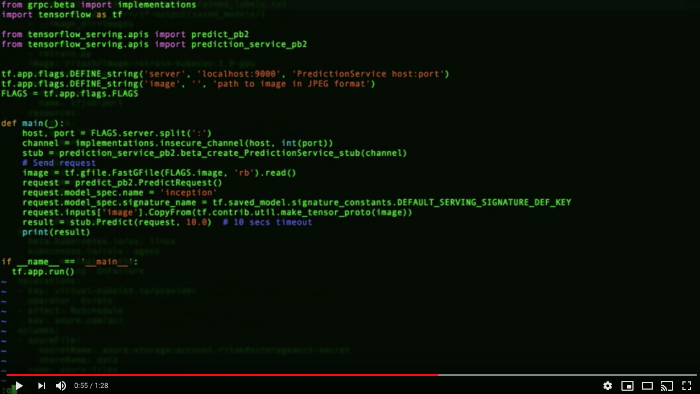](https://www.youtube.com/watch?v=t13F33I27TI)

### Provision Immutable Infrastructure with Kubernetes

* Using [acs-engine](https://github.com/Azure/acs-engine) with kubernetes v1.11.4

    [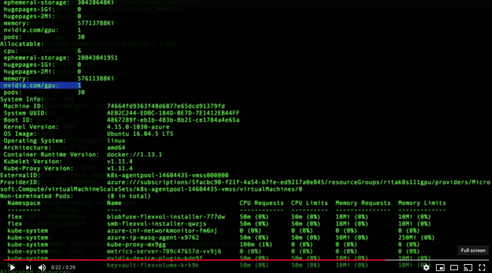](https://www.youtube.com/watch?v=lvH3ivDrocw)

### Deploy Machine Learning Components to Kubernetes with Kubeflow

* Install ksonnet version [0.9.2](https://ksonnet.io/#get-started).
* Install argo [CLI](https://github.com/argoproj/argo/blob/master/demo.md#1-download-argo)
* Run the following commands to deploy Kubeflow components in your Kubernetes cluster:

    ```bash
    # Create a namespace for the kubeflow deployment
    NAMESPACE=tfworkflow
    kubectl create namespace ${NAMESPACE}

    # Kubeflow releases
    # https://github.com/kubeflow/kubeflow/releases
    VERSION=v0.2.2

    # Initialize a ksonnet app. Set the namespace for it's default environment.
    APP_NAME=my-kubeflow
    ks init ${APP_NAME}
    # If you are managing many clusters, run the following instead:
    # CONTEXT=myk8scluster
    # KUBEVERSION=v1.11.4
    # ks init ${APP_NAME} --context $CONTEXT --api-spec=version:${KUBEVERSION}
    cd ${APP_NAME}
    ks env set default --namespace ${NAMESPACE}

    # Add a reference to Kubeflow's ksonnet manifests
    ks registry add kubeflow github.com/kubeflow/kubeflow/tree/${VERSION}/kubeflow

    # Install Kubeflow components
    ks pkg install kubeflow/core@${VERSION}
    ks pkg install kubeflow/tf-serving@${VERSION}
    # Install Argo for workflow
    ks pkg install kubeflow/argo

    # Create template for core components
    ks generate core kubeflow-core --name=kubeflow-core --namespace=${NAMESPACE}
    # Create template for argo components
    ks generate argo kubeflow-argo --name=kubeflow-argo --namespace=${NAMESPACE}

    # Customize Kubeflow's installation for AKS or acs-engine
    # ks param set kubeflow-core cloud aks
    ks param set kubeflow-core cloud acsengine
    # Customize jupyterhub's installation to create LoadBalancer service
    ks param set kubeflow-core jupyterHubServiceType LoadBalancer

    # Deploy Kubeflow
    ks apply default -c kubeflow-core
    # Deploy Argo
    ks apply default -c kubeflow-argo

    # Check status
    kubectl get pods -n kubeflow
    ```
    [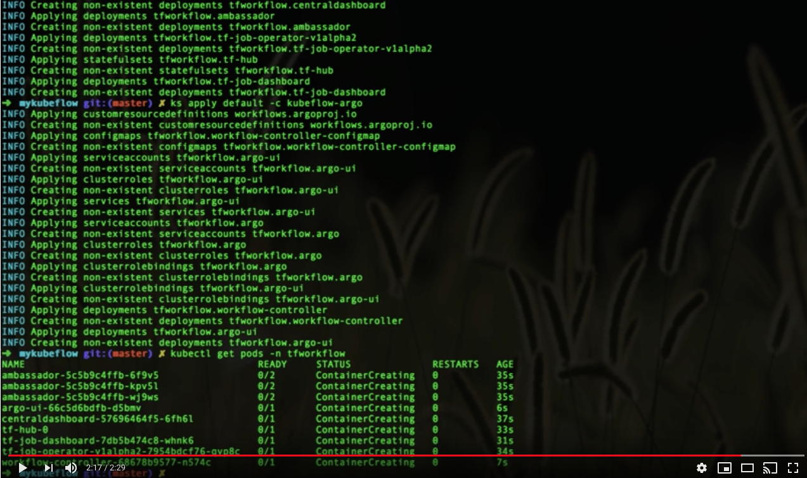](https://www.youtube.com/watch?v=OQvO0pFaeEc)

### Persist Data and Logs With Azure Storage

* Setup PVC components to persist data in pods. https://docs.microsoft.com/en-us/azure/aks/azure-disks-dynamic-pv 

    1. Setup storage account for Azure Files
    ```bash
    export RG_NAME=kubecon
    export STORAGE=kubeconstorage

    az storage account create --resource-group $RG_NAME --name $STORAGE --sku Standard_LRS
    ```

    2. Setup StorageClass, Roles, and PVC's
    ```bash
    # kubectl create -f ./deployments/azure-pvc-roles.yaml

    kubectl create -f ./deployments/azure-file-sc.yaml
    kubectl create -f ./deployments/azure-file-pvc.yaml
    ```

    Check status
    ```bash
    kubectl get pvc

    NAME          STATUS    VOLUME                                     CAPACITY   ACCESS MODES   STORAGECLASS          AGE
    azurefile     Bound     pvc-d686be3e-bc75-11e8-a08d-000d3a4f8d49   5Gi        RWX            azurefile             4h
    ```

* [OPTIONAL] If you want to use a static Azure files instead of creating PVCs, 

    1. Run the following to create a Kubernetes secret

    ```bash
    kubectl create secret generic azure-file-secret --from-literal=azurestorageaccountname=$STORAGE_ACCOUNT_NAME --from-literal=azurestorageaccountkey=$STORAGE_KEY
    ```

    2. From the deployment yaml, you can reference the static Azure file instance like:

    ```yaml
    
    volumes:
      - name: azure-files
        azureFile:
          secretName: azure-files-secret
          shareName: data
          readOnly: false
    ```


### Retrain Model with Kubeflow (TFJob)

* Deploy TFJob and tensorboard

    1. Run training job with TFJob
        ```bash
        kubectl create -f ./deployments/tfjob-retrain.yaml

        # check created tfjob
        kubectl get tfjob
        # check created pvc
        kubectl get pvc

        # check status of the training
        kubectl logs tfjob-retrain-master-0

        # after completed, clean up:
        kubectl delete tfjob tfjob-retrain
        
        ```

    2. Run Tensorboard (after the previous training is completed)
        ```bash
        kubectl create -f ./deployments/tfjob-tensorboard.yaml

        # Get public IP of tensorboard service
        kubectl get svc
        ```

    3. Clean up
        ```bash
        kubectl delete -f ./deployments/tfjob-tensorboard.yaml
        ```

### Hyperparameter Sweep - Scale and Test Experiments in Parallel using Kubernetes, Helm, Virtual Kubelet, and ACI
    
This step requires Azure Files mount to be available. Please refer to the [Persist Data and Logs With Azure Storage](#persist-data-and-logs-with-azure-storage) section.

* Ensure Helm and Virtual Kubelet are installed

    1. Ensure helm is installed and tiller is running in the cluster

    ```bash
    helm version
    ```

    2. Install Virtual Kubelet so we can scale our training to run on Azure Container Instance with GPU
    
    Provide the following in [hyperparameter/virtual-kubelet/values.yaml](hyperparameter/virtual-kubelet/values.yaml)

    ```yaml
    targetAKS:
    clientId:
    clientKey:
    tenantId:
    subscriptionId:
    aciRegion:
    ```

    Then install the Virtual Kubelet chart in your cluster.
    ```bash
    export VK_RELEASE=virtual-kubelet-latest
    CHART_URL=https://github.com/virtual-kubelet/virtual-kubelet/raw/master/charts/$VK_RELEASE.tgz
    helm install --name vk "$CHART_URL" -f ./hyperparameter/virtual-kubelet/values.yaml

    kubectl get nodes
    ...
    virtual-kubelet                     Ready     agent     5s        v1.11.2
    ```
* Deploy hyperparameter chart to run our experiments in parallel on Azure Container Instance

    ```bash
    helm install --name image-retrain-hyperparam ./hyperparameter/chart

    az container list -g <ACI RESOURCE GROUP>
    ```

    [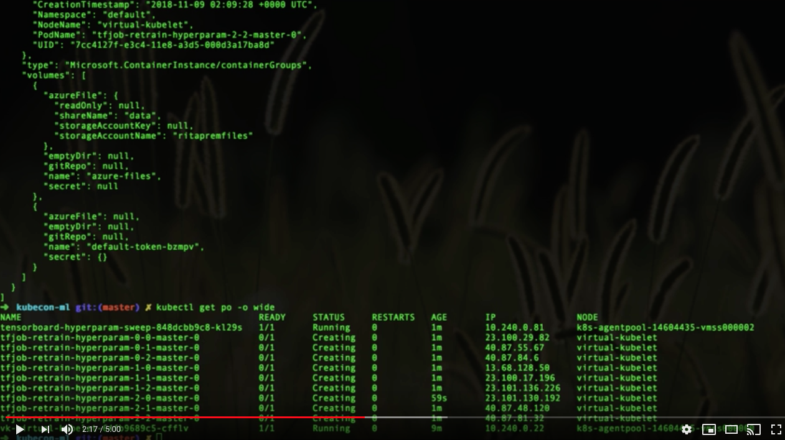](https://www.youtube.com/watch?v=EtOuo1dj56c)

    [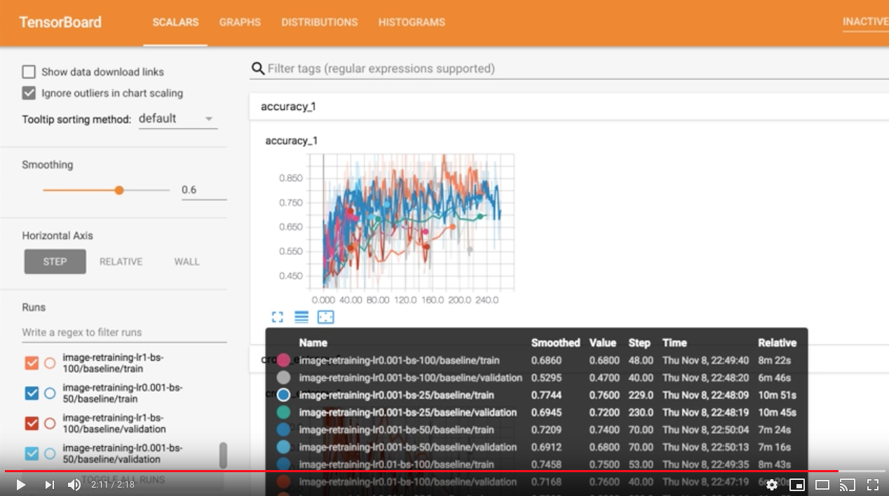](https://www.youtube.com/watch?v=E1p9bTN-fYc)

### Creating End to End Pipelines with Argo

* Deploy another storage option: Minio for S3 compatibility
    1. Update Minio deploy yaml with Azure storage account 

    ```yaml
    - name: MINIO_ACCESS_KEY
      value: "PUT AZURE STORAGE ACCOUNT NAME HERE"
    - name: MINIO_SECRET_KEY
      value: "PUT AZURE STORAGE ACCOUNT KEY HERE"
    ```

    2. Deploy Minio 
    ```bash
    # Deploy Minio
    kubectl create -f ./deployments/minio-azurestorage.yaml

    # Get endpoint of Minio server
    kubectl get service minio-service
    ```
* Create a pipeline with Argo workflow
    1. Set environment variables for Argo workflow

    ```bash
    export AZURE_STORAGEACCOUNT_NAME="PUT AZURE STORAGE ACCOUNT NAME HERE"
    export AZURE_STORAGEACCOUNT_KEY="PUT AZURE STORAGE ACCOUNT KEY HERE"
    MINIOIP=$(kubectl get svc minio-service -o jsonpath='{.status.loadBalancer.ingress[0].ip}')

    export S3_ENDPOINT=${MINIOIP}:9012
    export AWS_ENDPOINT_URL=${S3_ENDPOINT}
    export AWS_ACCESS_KEY_ID=$AZURE_STORAGEACCOUNT_NAME
    export AWS_SECRET_ACCESS_KEY=$AZURE_STORAGEACCOUNT_KEY
    export BUCKET_NAME=mybucket

    export DOCKER_BASE_URL=docker.io/ritazh # Update this to fit your scenario
    export S3_DATA_URL=s3://${BUCKET_NAME}/data/retrain/
    export S3_TRAIN_BASE_URL=s3://${BUCKET_NAME}/models
    export AWS_REGION=us-east-1
    export JOB_NAME=myjob-$(uuidgen  | cut -c -5 | tr '[:upper:]' '[:lower:]')
    export TF_MODEL_IMAGE=${DOCKER_BASE_URL}/image-retrain-kubecon:1.9-gpu # Retrain image from previous step
    export TF_WORKER=3
    export MODEL_TRAIN_STEPS=200

    # Create a secret for accessing the Minio server
    kubectl create secret generic aws-creds --from-literal=awsAccessKeyID=${AWS_ACCESS_KEY_ID} \
    --from-literal=awsSecretAccessKey=${AWS_SECRET_ACCESS_KEY} -n ${NAMESPACE}

    # Create a user for the workflow
    kubectl apply -f workflow/tf-user.yaml -n ${NAMESPACE}
    
    ```

    2. Submit a workflow to Argo

    ```bash
    # Submit a workflow to argo
    argo submit workflow/model-train-serve-workflow.yaml -n ${NAMESPACE} --serviceaccount tf-user \
    -p aws-endpoint-url=${AWS_ENDPOINT_URL} \
    -p s3-endpoint=${S3_ENDPOINT} \
    -p aws-region=${AWS_REGION} \
    -p tf-model-image=${TF_MODEL_IMAGE} \
    -p s3-data-url=${S3_DATA_URL} \
    -p s3-train-base-url=${S3_TRAIN_BASE_URL} \
    -p job-name=${JOB_NAME} \
    -p tf-worker=${TF_WORKER} \
    -p model-train-steps=${MODEL_TRAIN_STEPS} \
    -p namespace=${NAMESPACE} \
    -p tf-tensorboard-image=tensorflow/tensorflow:1.7.0 \
    -p s3-use-https=0 \
    -p s3-verify-ssl=0
    
    # Check status of the workflow
    argo list -n ${NAMESPACE}
    NAME                STATUS    AGE    DURATION
    tf-workflow-s8k24   Running   5m     5m 
    
    # Check pods that are created by the workflow
    kubectl get pod -n ${NAMESPACE} -o wide -w

    # Monitor training from tensorboard
    PODNAME=$(kubectl get pod -n ${NAMESPACE} -l app=tensorboard-${JOB_NAME} -o jsonpath='{.items[0].metadata.name}')
    kubectl port-forward ${PODNAME} -n ${NAMESPACE} 6006:6006
    
    # Get logs from the training pod(s)
    kubectl logs ${JOB_NAME}-master-0 -n ${NAMESPACE} 
    ```

    [](https://www.youtube.com/watch?v=5zJrvWy9srs) 

    3. Get Serving IP

    ```bash
    # Get public ip of the serving service once we reach the last stage of the workflow
    SERVINGIP=$(kubectl get svc inception-${JOB_NAME} -n ${NAMESPACE} -o jsonpath='{.status.loadBalancer.ingress[0].ip}')

    # Get detailed information of the workflow
    argo get tf-workflow-s8k24 -n ${NAMESPACE} 
    Name:             tf-workflow-s8k24
    Namespace:        tfworkflow
    ServiceAccount:   tf-user
    Status:           Succeeded
    Created:          Tue Oct 30 23:44:27 -0700 (26 minutes ago)
    Started:          Tue Oct 30 23:44:27 -0700 (26 minutes ago)
    Finished:         Tue Oct 30 23:53:56 -0700 (16 minutes ago)
    Duration:         9 minutes 29 seconds
    Parameters:       
    aws-endpoint-url: 40.76.11.177:9012
    s3-endpoint:    40.76.11.177:9012
    aws-region:     us-east-1
    tf-model-image: docker.io/ritazh/image-retrain-kubecon:1.9-gpu
    s3-data-url:    s3://mybucket/data/retrain/
    s3-train-base-url: s3://mybucket/models
    job-name:       myjob-b5e18
    tf-worker:      3
    model-train-steps: 200
    namespace:      tfworkflow
    tf-tensorboard-image: tensorflow/tensorflow:1.7.0
    s3-use-https:   0
    s3-verify-ssl:  0
    tf-ps:          2
    tf-serving-image: elsonrodriguez/model-server:1.6
    ks-image:       elsonrodriguez/ksonnet:0.10.1
    model-name:     inception
    model-hidden-units: 100
    model-batch-size: 100
    model-learning-rate: 0.01
    model-serving:  true
    model-serving-servicetype: LoadBalancer
    model-serving-ks-url: github.com/kubeflow/kubeflow/tree/master/kubeflow
    model-serving-ks-tag: 1f474f30
    aws-secret:     aws-creds

    STEP                            PODNAME                       DURATION  MESSAGE
    ✔ tf-workflow-s8k24                                                    
    └---✔ get-workflow-info                                                
        └---✔ tensorboard                                                  
            └---✔ train-model                                              
                └---✔ serve-model  tf-workflow-s8k24-3774882124  1m        
                                                                                    
    ✔ onExit                                                               
    └---✔ cleanup                  tf-workflow-s8k24-1936931737  1m
   
    ```

### Serve a Trained Model for Inference with Kubeflow (TF Serving)

* Run test client against the Serving endpoint to get predictions
    Using the serving IP from the previous step, run the following:
    ```bash
    python serving/inception_client.py --server ${SERVINGIP}:9000 --image test/fbb1.jpeg

    # You will see the following output
    outputs {
        key: "classes"
        value {
            dtype: DT_STRING
            tensor_shape {
            dim {
                size: 2
            }
            }
            string_val: "fbb"
            string_val: "notfbb"
        }
        }
        outputs {
        key: "prediction"
        value {
            dtype: DT_FLOAT
            tensor_shape {
            dim {
                size: 1
            }
            dim {
                size: 2
            }
            }
            float_val: 0.96350902319
            float_val: 0.0364910177886
        }
        }
        model_spec {
        name: "inception"
        version {
            value: 1
        }
        signature_name: "serving_default"
    }
    ```

    [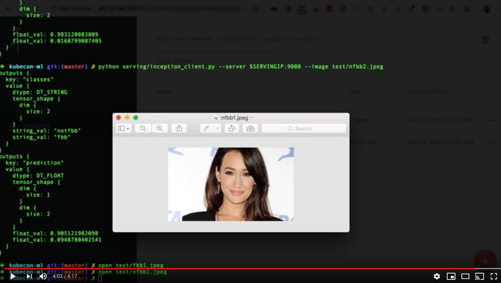](https://www.youtube.com/watch?v=2P50c-srlkA) 

### Rapid Prototyping with Self-service Jupyter Notebook from JupyterHub with GitHub OAuth

* Ensure the JupyterHub component is running and the service has a public IP
    1. Get the pod and the service

    ```bash
    kubectl get pod -n ${NAMESPACE} -l app=tf-hub
    NAME       READY     STATUS    RESTARTS   AGE
    tf-hub-0   1/1       Running   0          30m

    kubectl get svc -n ${NAMESPACE} -l app=tf-hub-lb  
    NAME        TYPE           CLUSTER-IP   EXTERNAL-IP       PORT(S)        AGE
    tf-hub-lb   LoadBalancer   10.0.91.30   137.xx.xx.xx   80:31137/TCP   1d
    ```

    2. Create an OAuth app on GitHub. Use the external IP of tb-hub-lb.
    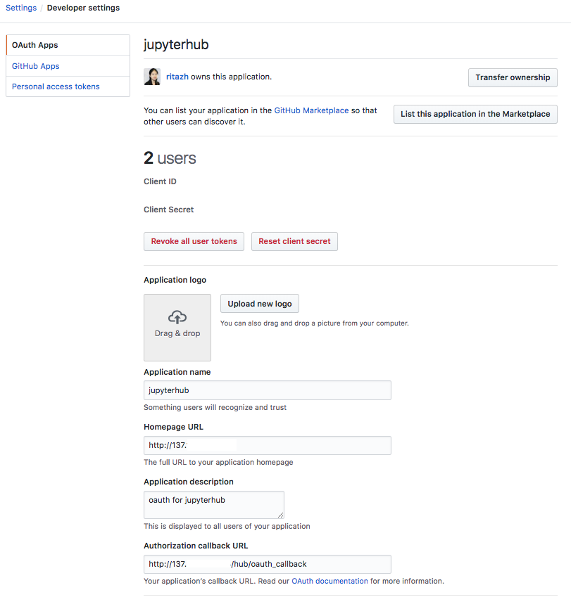
    
    3. By default JupyterHub uses dummy authenticator to use plaintext username and password for login. Edit the JupyterHub configmap to enable GitHub OAuth.
    ```bash
    kubectl edit configmap jupyterhub-config -n ${NAMESPACE}

    # Replace the dummyauthenticator with GitHubOAuthenticator
    # c.JupyterHub.authenticator_class = 'dummyauthenticator.DummyAuthenticator'
    c.JupyterHub.authenticator_class = GitHubOAuthenticator
    c.GitHubOAuthenticator.oauth_callback_url = 'http://137.xx.xx.xx/hub/oauth_callback'
    c.GitHubOAuthenticator.client_id = 'GET THIS FROM GITHUB DEVELOPER SETTING'
    c.GitHubOAuthenticator.client_secret = 'GET THIS FROM GITHUB DEVELOPER SETTING'
    ```
    
    4. Restart the tf-hub-0 pod

    5. Launch JupyterHub from a browser using the external IP from the tf-hub-lb service. Everyone on the team can now create their own Jupyter Notebook instance after signing in with their github account and selecting the resources they need to create their own Jupyter Notebook instance.
    
    [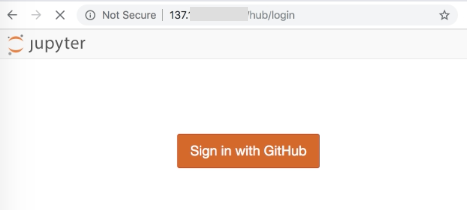](https://www.youtube.com/watch?v=kGr6mTUEBhs) 

    6. Start using your own Jupyter Notebook instance to prototype

    [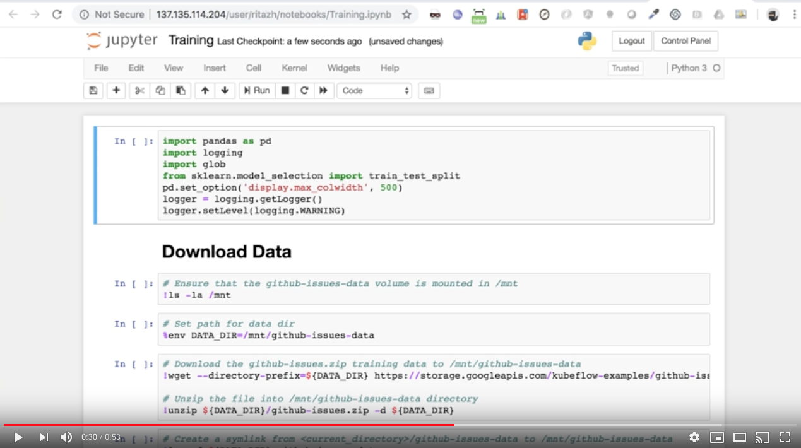](https://www.youtube.com/watch?v=8MTGAT6qsXo) 


